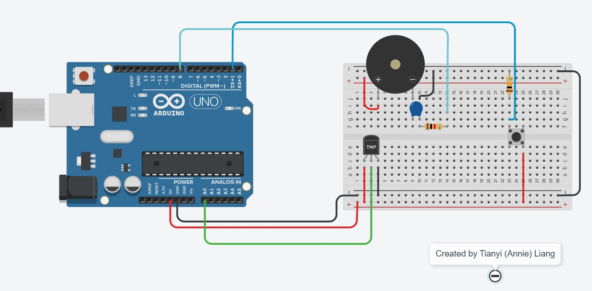

## ThermoBuzzer, a thermosense to prevent overheated stoves

Place it near the stoves. 

Once the temperature continuously reaches 50 degrees (able to modify using a constant), ThermoBuzzer will beep continuously every five minutes until the button is clicked to ensure someone is there.

Once the temperature reaches 70 degrees (able to modify using a constant), ThermoBuzzer will beep continuously right away until the button is clicked.

### Circuit Diagram

### Thanks for checking it out!
Any questions or thoughts, feel free to reach out to atianyi.liang@gmail.com.
