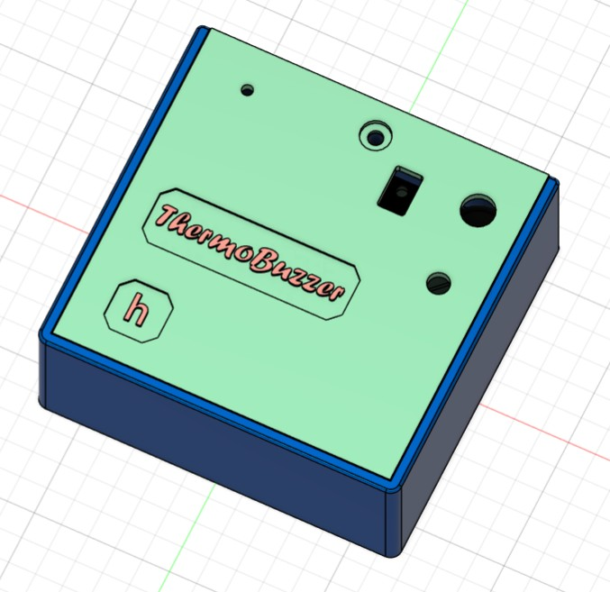
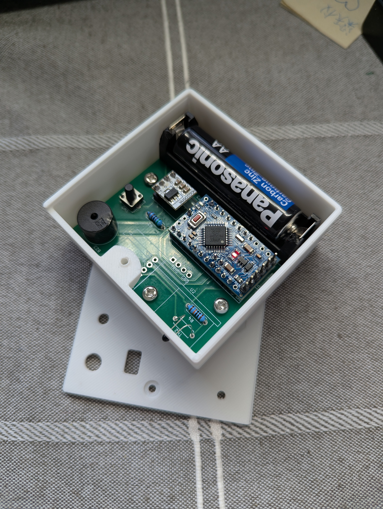
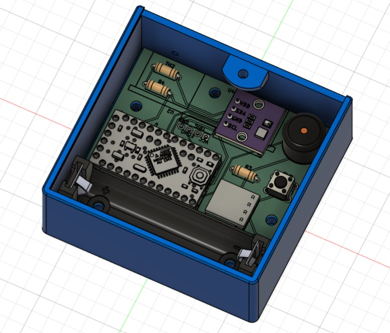
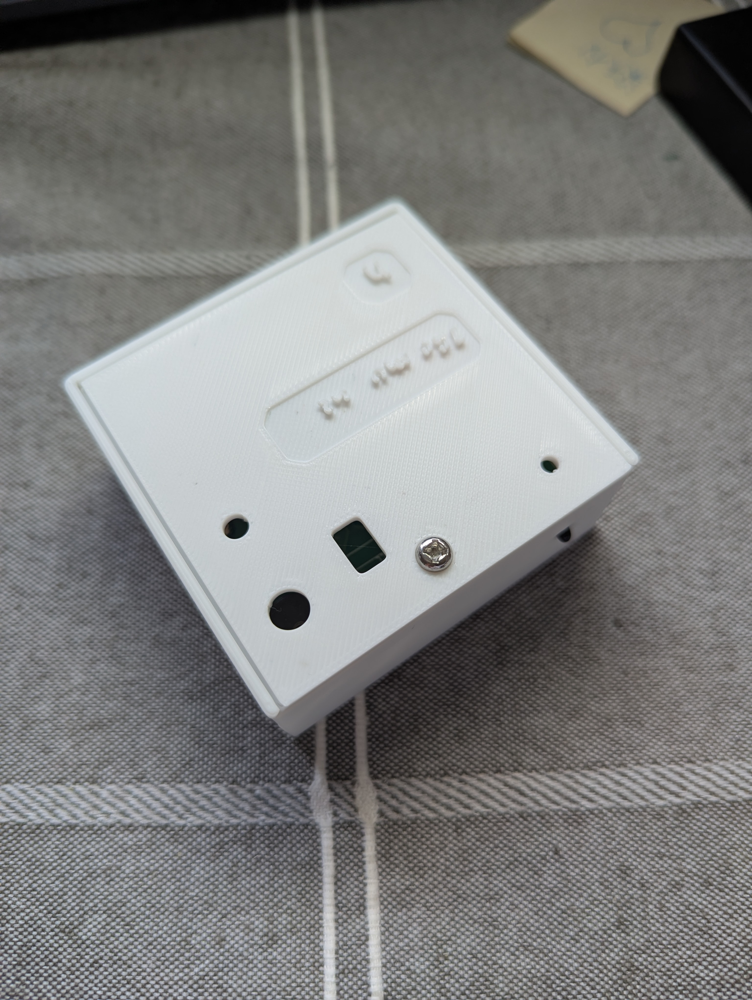
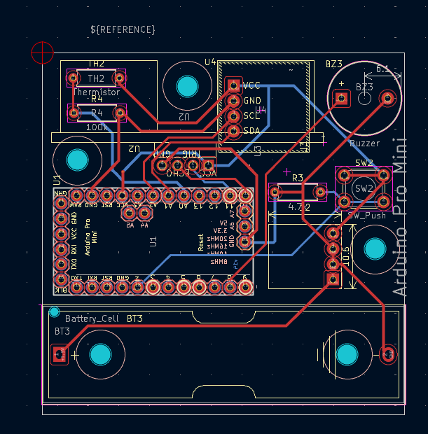
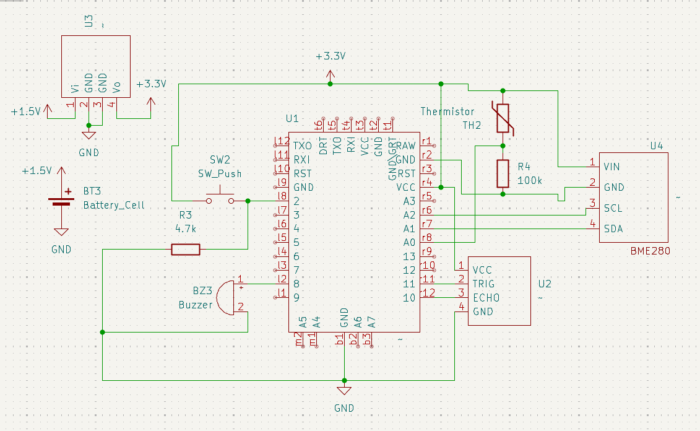
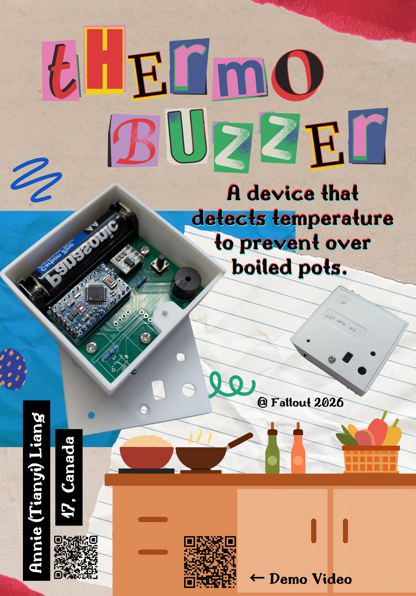
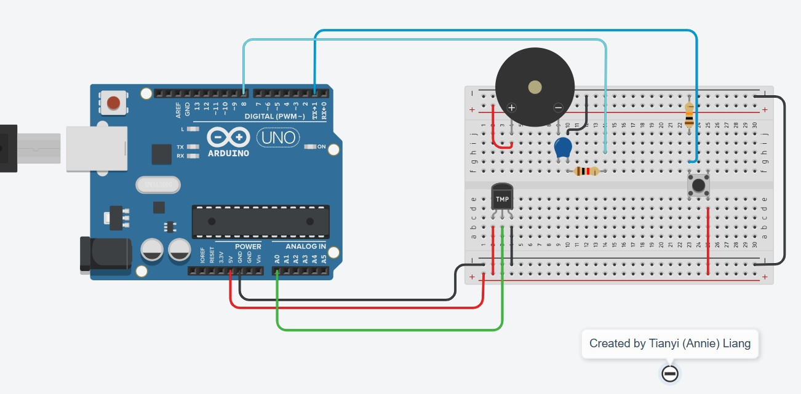

## ThermoBuzzer, a Thermosenser to Prevent Over Boiled Pots. 

### What it is
This device integrates a thermosensor, buzzer, and a button, and can make alarms when the temperature (the steam it detects) reaches a certain threshold. 

### Motivation / Inspiration / Problem

One Saturday afternoon my father left the stove, with the water heating up, for almost half an hour until the pot boiled dry and the fire alarm turned on, simply because he forgot the fact that the stove is still on. That moment inspired me to make a change - to build a device that could sense the temperature and alarm people that the burner is still active. 

### How to use it

1. Solder the electrical parts (see BOM) onto the PCB. Insert the PCB into the case and secure using m3 self-tapping screws

2. Insert the battery to start the machine. Slide in the lid and secure using a m3 self-tapping screw

3. Place it near the stoves. 

    Once the temperature continuously reaches 50 degrees (able to modify using a constant), ThermoBuzzer will beep continuously every five minutes until the button is clicked to ensure someone is there.

    Once the temperature reaches 70 degrees (able to modify using a constant), ThermoBuzzer will beep continuously right away until the button is clicked.

4. (Optional) To adjust the temperature threshold, take out the pcb from the case, modify amd reupload the program to the arduino pro mini.

### Code Example
Go checkout the example code in firmware/thermobuzzer.imo and upload it onto the arduino pro mini

For how to upload code onto arduino pro mini using arduino uno, check out 
https://www.instructables.com/How-to-Program-Arduino-Pro-Mini-Using-Arduino-UNO/

### Image of the entire cad / Finished product

### Image of the entire cad (with lid) / Finished product

### Image of the final PCB

### Image of the wiring schematic

## Zine page

## Demo Video

https://youtu.be/lv5Z6S4dAAs

## Product Design

### CAD dimensions
Side + top + base thickness: 2mm
supporting bar: r=4mm, h=4mm
Case height: 2mm base + 4mm supporting bar + 1.6mm board + 15.1mm battery height + 2mm flex + 2mm top

### Circuit Diagram 

### Sub-circuit Description
Diagrams from www.circuitbasics.com. 
#### Temperature sensor (NTC MF11) and Arduino

NTC MF11
The value of the resistor should be roughly equal to the resistance of the thermistor.

#### BME280
Reference links:

BME280
https://randomnerdtutorials.com/bme280-sensor-arduino-pressure-temperature-humidity/

https://docs.cirkitdesigner.com/component/3d8e6da8-841a-47a6-a1aa-0aa902c905e1/aht20bmp280

Code: https://randomnerdtutorials.com/bme280-sensor-arduino-pressure-temperature-humidity/

Arduino Library: adafruit bme280

It supports SPI or I2C communication

| BME280 |	Arduino |
|--|--|
|Vin | 	5V |
|GND |	GND |
|SCL |	A5 |
|SDA |	A4 |

| BME280 |	Arduino |
|--|--|
|SCK (SPI Clock)|	Pin 13|
|SDO (MISO)|	Pin 12|
|SDI (MOSI)|	Pin 11|
|CS (Chip Select)|	Pin 10|

#### Buzzer, Button and Arduino

## Requirements (Need future work)
| Req # | Requirements |
|---|---|
| 1.1 | The thermosensor shall be able to measure the temperature accurately for further actions|
| 1.2 | The thermosensor shall be able to beep when the temperature reaches a certain threshold |
| 1.3 | The button should be able to stop the buzzer from beeping |
| 1.4 | The temperature threshold should be adjustable by the user |

## Bill of Materials (BOM)
| Product name          | Product Description                          | Amount | Unit Price | Shipping Fee | Total Price | Link                                                                                                                                                                                                                                                                                                                                                                                                                                                                                                                                                                                                                                  |
| --------------------- | -------------------------------------------- | ------ | ---------- | ------------ | ----------- | ------------------------------------------------------------------------------------------------------------------------------------------------------------------------------------------------------------------------------------------------------------------------------------------------------------------------------------------------------------------------------------------------------------------------------------------------------------------------------------------------------------------------------------------------------------------------------------------------------------------------------------- |
| Arduino Pro Mini,      | ÊATMEGA328P 3.3V 8MHz                        | 1      | $6.14      |              | $6.14       | https://www.aliexpress.com/item/1005009384358010.html?spm=a2g0o.detail.0.0.3d69kxh4kxh4TT&mp=1&pdp_npi=6%40dis%21CAD%21CAD+12.34%21CAD+6.19%21%21CAD+6.19%21%21%21%402101e2b217772431183538792e7ffd%2112000048937356319%21ct%21CA%216218818596%21%211%210%21                                                                                                                                                                                                                                                                                                                                                                          |
| Temperature Sensor,    | AHT20+BMP280                                 | 1      | $4.59      |              | $4.59       | https://www.aliexpress.com/item/1005005982427374.html?spm=a2g0o.detail.0.0.91dbOMYjOMYjR3&mp=1&sourceType=570&pdp_npi=6%40dis%21CAD%21CAD+7.57%21CAD+4.59%21%21CAD+4.59%21%21%21%402101d6ff17773442520382830e94da%2112000035166631251%21ct%21CA%216218818596%21%211%210%21&pdp_ext_f=%7B%22cart2PdpParams%22%3A%7B%22sourceType%22%3A%22570%22%2C%22cartSource%22%3A%22main%22%7D%7D                                                                                                                                                                                                                                                  |
| Thermisor,             | 10PCS NTC ThermistorÊMF52 NTC-MF52AT         | 1      | 3.46       |              | $3.46       | https://www.aliexpress.com/item/1005007016386078.html?spm=a2g0o.detail.0.0.177fzTz7zTz79e&mp=1&pdp_npi=6%40dis%21CAD%21CAD+7.07%21CAD+3.46%21%21CAD+3.46%21%21%21%402101d6ff17773445233621202e94da%2112000039082044667%21ct%21CA%216218818596%21%211%210%21                                                                                                                                                                                                                                                                                                                                                                           |
| Passive Buzzer,        | 10PCS Passive Buzzer Kits 12085              | 1      | 2.79       |              | $2.79       | https://www.aliexpress.com/item/1005007038458518.html?spm=a2g0o.detail.0.0.291d6UQD6UQDcn&mp=1&sourceType=570&pdp_npi=6%40dis%21CAD%21CAD+7.56%21CAD+3.09%21%21CAD+3.09%21%21%21%402101d6ff17773446457813771e94da%2112000039180355191%21ct%21CA%216218818596%21%211%210%21&pdp_ext_f=%7B%22cart2PdpParams%22%3A%7B%22sourceType%22%3A%22570%22%2C%22cartSource%22%3A%22main%22%7D%7D                                                                                                                                                                                                                                                  |
| Buttons,               | 6\*6\*10mm 20pics                            | 1      | 2.29       |              | $2.29       | https://www.aliexpress.com/item/1005006046180384.html?spm=a2g0o.cart.0.0.31e138dackOqlz&mp=1&pdp_npi=6%40dis%21CAD%21CAD+2.29%21CAD+2.29%21%21CAD+2.29%21%21%21%402103119c17773470443845760e9623%2112000035472972539%21ct%21CA%216218818596%21%211%210%21                                                                                                                                                                                                                                                                                                                                                                             |
| AA Battery,            | 1                                            | NA     |            |              |             |
| THT Battery Holder    | 14500 Battery Box With Pins 1AA 1.5V         | 1      | 0.33       | 7.48         | $7.81       | https://www.aliexpress.com/item/1005005620966310.html?spm=a2g0o.cart.0.0.358a38dadNcuNR&mp=1&pdp_npi=6%40dis%21CAD%21CAD+0.38%21CAD+0.32%21%21CAD+0.32%21%21%21%402101eee917774109006605329ec0dc%2112000033776650718%21ct%21CA%216218818596%21%215%210%21                                                                                                                                                                                                                                                                                                                                                                             |
| Voltage Regulator,     | 0.8V-5V to 3V 3.3V 5V Boost Voltage Regulate | 1      | 3.85       |              | $3.85       | https://www.aliexpress.com/item/1005006167931077.html?spm=a2g0o.detail.0.0.4a7cjdtRjdtRpQ&mp=1&pdp_npi=6%40dis%21CAD%21CAD+3.96%21CAD+3.86%21%21CAD+3.86%21%21%21%402101d6ff17773444964128610e94da%2112000036084126229%21ct%21CA%216218818596%21%211%210%21                                                                                                                                                                                                                                                                                                                                                                           |
| m3 self-tapping screw, | ZONSANTA M3x50pc 5mm                         | 1      | 2.79       |              | $2.79       | https://www.aliexpress.com/item/4000982209705.html?spm=a2g0o.productlist.main.2.5e0a5049GO2c6k&algo_pvid=d9d1041d-5b82-4d1d-adb8-2c50ae22e721&algo_exp_id=d9d1041d-5b82-4d1d-adb8-2c50ae22e721-1&pdp_ext_f=%7B%22order%22%3A%2214058%22%2C%22eval%22%3A%221%22%2C%22fromPage%22%3A%22search%22%7D&pdp_npi=6%40dis%21CAD%212.04%211.99%21%21%211.46%211.42%21%40210328d417774091351247794e1c13%2110000013191635027%21sea%21CA%216218818596%21X%211%210%21n_tag%3A-29919%3Bd%3A26a99932%3Bm03_new_user%3A-29895&curPageLogUid=Y5TAugc4ns7L&utparam-url=scene%3Asearch%7Cquery_from%3A%7Cx_object_id%3A4000982209705%7C_p_origin_prod%3A |
| resistor,              | 100k                                         | 1      | 0          |              | $0.00       |                                                                                                                                                                                                                                                                                                                                                                                                                                                                                                                                                                                                                                       |
| resistor,              | 10k                                          | 1      | 0          |              | $0.00       |                                                                                                                                                                                                                                                                                                                                                                                                                                                                                                                                                                                                                                       |
| head pins,             | 5 male 5 female                              | 1      | 5.19       |              | $5.19       | https://www.aliexpress.com/item/1005007235591794.html?spm=a2g0o.cart.0.0.31e138dackOqlz&mp=1&sourceType=570&pdp_npi=6%40dis%21CAD%21CAD+16.72%21CAD+5.19%21%21CAD+5.19%21%21%21%402103119c17773470443845760e9623%2112000039908542823%21ct%21CA%216218818596%21%211%210%21&pdp_ext_f=%7B%22cart2PdpParams%22%3A%7B%22sourceType%22%3A%22570%22%2C%22cartSource%22%3A%22main%22%7D%7D                                                                                                                                                                                                                                                   |
| Total                 |                                              |        |            |              | $38.91      |                                                                                                                                                                                                                                                                                                                                                                                                                                                                                                                                                                                                                                       |

### Thanks for checking it out!
Any questions or thoughts, feel free to reach out to atianyi.liang@gmail.com.
